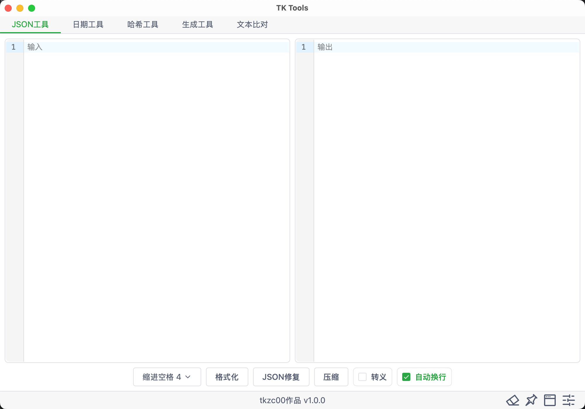
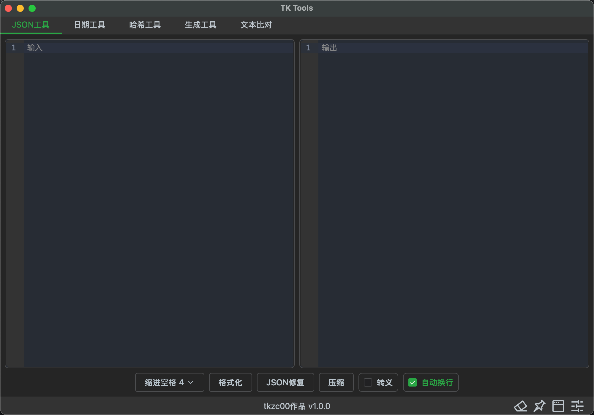

# tk-tools

使用Tauri2+Vue3编写的测试常用工具箱

[Electron 版本](https://github.com/zktkzc/TK-Tools)(已不更新)

## 软件功能

- [X] JSON格式化
- [X] 时间戳工具
- [X] 日期计算器
- [X] 文本哈希
- [X] 文件哈希
- [X] 哈希值比对
- [X] 生成固定长度的随机字符
- [X] 生成UUID
- [X] 文本比对
- [X] 自动更新

## 软件界面

### Light



### Dark



## 项目初始化

### 安装

```bash
$ pnpm install
```

### 开发

```bash
$ pnpm tauri dev
```

### 编译

```bash
$ pnpm tauri build
```

生成的软件在目录`src-tauri/target/release/bundle/`下
